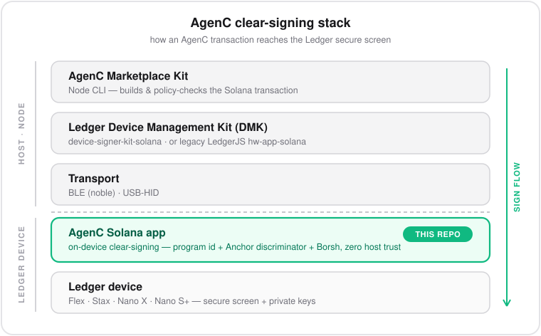

<h1 align="center">AgenC Ledger Flex App</h1>

<p align="center"><em>Clear-signing for AgenC marketplace transactions on Ledger devices.</em></p>

<p align="center">
  
</p>


Private firmware workspace for an AgenC-aware Ledger Flex signing app.

This repository is based on Ledger's upstream
[`app-solana`](https://github.com/LedgerHQ/app-solana) codebase. It keeps the
Solana transaction parsing, signing, derivation, and APDU foundations, then adds
native AgenC instruction parsing so supported AgenC actions can be reviewed on
the Ledger secure screen.

## Status

Current milestone:

- AgenC instruction parser + on-device display implemented in `libsol`, covering
  the full marketplace lifecycle (see [Clear-Signing Scope](#clear-signing-scope))
- `create_task` clear-signing covers SOL and SPL-token rewards, multi-worker and
  non-default task types, and standalone (non-paired) creates
- a side-by-side app named `AgenC Solana` has been built and installed on a real
  Ledger Flex, alongside the official Ledger `Solana` app
- clear-signing has been driven end-to-end over **Bluetooth via the Device
  Management Kit** from the AgenC kit on a real Flex (see
  [Clear-Signing over BLE + DMK](#clear-signing-over-ble--device-management-kit-dmk))
- host unit tests cover the parser/display; Ragger golden-image tests cover the
  on-device secure screens

Current reproducible build hashes (`bin/app.sha256`), source-built for all four
supported devices with `APPNAME="AgenC Solana"`:

| Device | app.sha256 |
|--------|------------|
| Flex | `f9fc21c5ef1f59cf43dbc7e37770fef10c2a2624781bb1f91cbe7e814e75e10b` |
| Stax | `bc476702c87304bcb615e4ecedcc0b34e8feaaab47aaf50d7d56ae79f60c6be5` |
| Nano X | `997627d488971ffa564804c53798f8b87e8b3e80ef62781c711074298b176aff` |
| Nano S+ | `90dac181bfb1d87fc5492272c3408fe62db93ea66271fe7d59146d638d341ecc` |

These supersede the earlier Flex-only `f3da723b…` build, which predates the
expanded create-task clear-signing coverage and needs a fresh hardware load.

This is an engineering fork, not a production Ledger Live release.

## Safety Rule

Do not replace the official installed Ledger `Solana` app.

For hardware testing, this fork is packaged as a separate Ledger app:

```text
AgenC Solana
```

Do not use upstream `make load` for this fork. The upstream default targets app
name `Solana` with `--delete`. Use the guarded scripts under `tools/agenc/`
instead.

## Clear-Signing Scope

The v1 parser focuses on the AgenC marketplace actions that matter for a first
secure-screen workflow:

- register agent
- create task — standalone, or as the `create_task` + `configure_task_validation`
  review pair (which also shows the review window)
- attach job spec
- claim task
- submit result
- accept result
- reject result
- cancel task
- expire claim

`create_task` renders the full reviewable shape:

- reward — SOL amount, **or**, for SPL-token rewards, the raw token base-unit
  amount plus the token mint (the device cannot resolve mint decimals offline, so
  it shows both explicitly rather than a misleading SOL-formatted value)
- task and creator accounts
- the 32-byte content-commitment hash (the on-chain `description` under the
  moderation gate)
- deadline, max workers, task type (shown when non-default), min reputation
- program id

The device derives display fields from signed Solana transaction bytes:

- program id
- Anchor discriminator
- instruction data
- account indexes and account keys

The device does not trust host-provided display strings for security-critical
review text.

Some fields are intentionally shown as incomplete when they cannot be derived
from the transaction bytes alone. For example, the app does not infer settlement
reward or cancellation refund amounts from account state.

## Repository Layout

- `libsol/agenc_instruction.*`
  Native AgenC instruction parser and display model.
- `libsol/agenc_instruction_test.c`
  Direct parser tests and serialized Solana message fixtures.
- `tests/application_client/agenc_cmd_builder.py`
  Python fixture builder for AgenC transactions.
- `tests/python/test_agenc_clear_signing.py`
  Ragger/Speculos coverage for Flex secure-screen flows.
- `tests/python/snapshots/flex/test_agenc_*`
  Golden Flex screenshots for supported AgenC actions.
- `icons/icon_agenc_*` and `glyphs/home_agenc_*`
  Ledger icon and NBGL home glyph assets generated from the AgenC logo.
- `tools/agenc/`
  Safe build, load, APDU, and icon helper scripts for the side-by-side app.
- `doc/agenc-ledger-flex.md`
  Hardware loading notes and real-device result log.

## Build

Build the side-by-side Flex app:

```sh
tools/agenc/build-flex.sh
```

This uses Ledger's dev-tools container and builds with:

```text
APPNAME="AgenC Solana"
```

The output is written to:

- `bin/app.elf`
- `bin/app.hex`
- `bin/app.apdu`
- `bin/app.sha256`

## Test

Run the C parser/message tests:

```sh
docker run --rm -v "$PWD:/app" -w /app \
  ghcr.io/ledgerhq/ledger-app-builder/ledger-app-builder-lite:latest \
  make -C libsol clean

docker run --rm -v "$PWD:/app" -w /app \
  ghcr.io/ledgerhq/ledger-app-builder/ledger-app-builder-lite:latest \
  make -C libsol
```

Run focused Flex Ragger/Speculos tests:

```sh
docker run --rm -v "$PWD:/app" -w /app \
  ghcr.io/ledgerhq/ledger-app-builder/ledger-app-dev-tools:latest \
  sh -lc 'rm -rf .tmp-ragger && trap "rm -rf .tmp-ragger" EXIT &&
  mkdir -p .tmp-ragger/tmp .tmp-ragger/cache &&
  TMPDIR=/app/.tmp-ragger/tmp python3 -m venv --system-site-packages .tmp-ragger/venv &&
  . .tmp-ragger/venv/bin/activate &&
  TMPDIR=/app/.tmp-ragger/tmp PIP_CACHE_DIR=/app/.tmp-ragger/cache \
    python -m pip install --no-cache-dir base58 ecdsa solders solana "ragger[tests]" &&
  pytest tests/python/test_agenc_clear_signing.py --tb=short -v --device flex'
```

## Hardware Loading

Confirm the Flex is visible:

```sh
tools/agenc/list-flex-apps.sh
```

Generate a side-by-side offline APDU:

```sh
tools/agenc/generate-load-apdu.sh
```

Load the app only after confirming the target is `AgenC Solana`:

```sh
AGENC_CONFIRM_SIDE_BY_SIDE_LOAD=1 tools/agenc/load-flex.sh
```

The load script refuses to run without `AGENC_CONFIRM_SIDE_BY_SIDE_LOAD=1`.
It calculates `dataSize` and `installparamsSize` from `debug/app.map`, matching
Ledger SDK behavior.

Successful hardware load parameters from the prior `f3da723b…` Flex load (recorded
on a real device; predates the expanded create-task coverage above, so a fresh load
of the current build is needed):

```text
appName=AgenC Solana
dataSize=512
installparamsSize=345
app.sha256=f3da723b7b8ad700598e072a7a30cd6526efab78d4b4cb32e4c3d81617d739c1
```

Post-load `listApps` confirmed both `Solana` and `AgenC Solana` installed on
the same Ledger Flex.

The latest loaded side-by-side build includes default clear-signing recognition
for the kit mainnet program id
`HJsZ53Zb27b8QMRbQpuDngE44AdwCGxvEZr61Zmxw1xK`.

## Program ID Policy

The current code recognizes the verified AgenC mainnet program id by default:

```text
HJsZ53Zb27b8QMRbQpuDngE44AdwCGxvEZr61Zmxw1xK
```

That id now matches the kit mainnet preset and the generated kit Ledger
fixtures. If the deployed program id changes, regenerate the kit Ledger
fixtures and update this parser constant in the same release.

If a mainnet AgenC transaction does not show the `AgenC action` screens on the
device, reject it.

## Current Signed-Data Limits

The app only displays values that are present in the signed transaction bytes.

- `submit_task_result` decodes AgenC artifact result data and displays the
  artifact SHA-256 when the kit uses `artifact:sha256:*` result data.
- `claim_task_with_job_spec` can display the task/job-spec account addresses,
  but cannot display the job-spec hash or URI because the current protocol
  instruction does not carry those fields in the claim instruction data.
- `accept_task_result` and `cancel_task` cannot display reward/refund amounts
  because those values come from on-chain task/escrow state, not the current
  instruction data.

Showing those claim and settlement commitments on-device requires a protocol
instruction upgrade or another commitment that is included in the bytes the
Ledger signs.

## Relationship To The Kit

This repository owns firmware parsing, display, and Ledger device tests.

The AgenC Marketplace Agent Kit owns transaction construction, policy checks,
CLI UX, and Ledger transport integration.

The intended boundary is:

- kit builds and policy-checks the Solana transaction
- Ledger app parses the signed bytes and displays trusted review fields
- private keys remain on the Ledger device

## Clear-Signing over BLE + Device Management Kit (DMK)

The AgenC Marketplace Agent Kit can drive this app over Bluetooth through Ledger's
[Device Management Kit](https://github.com/LedgerHQ/device-sdk-ts) so AgenC mainnet
transactions are clear-signed on the device secure screen.

The relevant detail: DMK's Solana signer opens the app named `Solana` (the stock
app) by default, which blind-signs AgenC instructions. To clear-sign, the kit must
open **this** app instead. It does so with an app-name override:

- `AGENC_LEDGER_APP_NAME="AgenC Solana"` (or the equivalent signer option) makes the
  kit run `OpenAppDeviceAction({ appName: "AgenC Solana" })` on the DMK session and
  pass `skipOpenApp: true` to every signer call, so the signer does not switch back
  to the stock `Solana` app.
- `AGENC_LEDGER_DMK_BLE=1` enables the kit's DMK Node-BLE transport.

```sh
AGENC_LEDGER_DMK_BLE=1 AGENC_LEDGER_APP_NAME="AgenC Solana" \
  agenc-marketplace --network mainnet \
  --signer ledger --ledger-backend dmk --ledger-transport ble --ledger-key 0/0 \
  <command>
```

The full build → install → drive-over-BLE+DMK workflow, including the kit wiring,
is documented for agents and engineers in [`AGENTS.md`](./AGENTS.md). If a mainnet
AgenC transaction shows a generic "Blind signing / Unrecognized format" screen, the
stock `Solana` app is open instead of `AgenC Solana` — reject on the device and fix
the setup rather than approving blind.

## Upstream

Upstream base:

```text
https://github.com/LedgerHQ/app-solana
```

Local remote convention:

- `origin`: Ledger upstream
- `agenc`: private AgenC app repo
